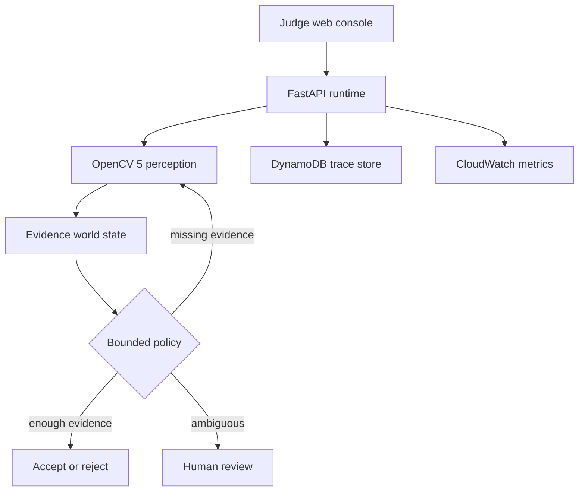

# Competition architecture

The judge surface and cloud runtime use the same bounded decision path. OpenCV
measurements are not decorative: they update the evidence state before the
policy chooses the next action.

## Decision loop

1. **Perceive.** OpenCV 5 measures query/candidate quality, ORB keypoint
   support, RANSAC homography inliers, foreground color agreement, and
   silhouette overlap.
2. **Update state.** The agent records top and runner-up similarity, quality,
   evidence count, source diversity, remaining acquisition budget, and
   provenance.
3. **Decide.** A versioned deterministic policy chooses `accept`,
   `retrieve_more`, `human_review`, or `reject`.
4. **Act.** Retrieval is bounded by a fixed evidence budget. Ambiguity and
   exhaustion stop at human review rather than forcing a match.
5. **Verify.** Every state transition is appended to a SHA-256-linked trace.
   Human review is stored beside the model output and never overwrites it.

## AWS responsibility split

| Component | Responsibility |
|---|---|
| App Runner | Serves the judge UI/API and executes the same OpenCV 5 code path |
| DynamoDB | Persists full run records and human-review decisions |
| CloudWatch | Receives fleet-wide and per-case latency, trace, action, and review metrics |
| ECR | Stores the immutable application image used by App Runner |

The six CC0 fixtures ship inside the immutable container for a fast,
deterministic judge experience. They are intentionally not represented as
market data.

Submission artwork:
[`competition_architecture.svg`](assets/competition_architecture.svg) and
[`competition_architecture.png`](assets/competition_architecture.png).