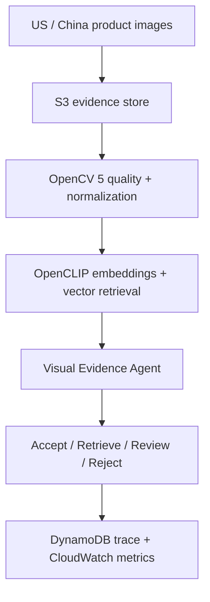

# OpenCV AI Competition 2026 — Execution Plan

## Entry

- **Project:** BridgeTrend Visual Evidence Agent
- **Participant:** Alex Xiaoyu Ji (solo)
- **Target:** Overall Award and Agentic Vision Award
- **Deadline:** October 26, 2026 at 11:45 PM PDT
- **Repository track:** `codex/opencv-agentic-vision`

## Product claim

BridgeTrend Visual Evidence Agent helps a researcher or cross-border merchant
decide whether a product seen in one market is the same product, a close
substitute, a shared visual trend, or an unsupported match in another market.
It does not force every pair into a yes/no prediction. It chooses one of four
auditable actions:

1. **Accept** — evidence is strong and unambiguous.
2. **Retrieve more** — request another image or independent source.
3. **Human review** — surface an ambiguous pair with reasons.
4. **Reject** — evidence or image quality is inadequate.

## Competition-period work boundary

The repository contained an OpenCLIP retrieval baseline before this competition
track began. The following are the new competition contributions:

- OpenCV 5 decoding, alpha compositing, contrast normalization, image-quality
  evidence, and letterbox preprocessing.
- A deterministic and testable visual-evidence decision policy.
- Structured decision traces, abstention, retrieval requests, and human review.
- AWS deployment, observability, responsible-use, and cost evaluation.
- A public demo, failure-case gallery, report, and short video.

The COM5006 classroom roadmap remains documented on `main`. The Devpost entry
and competition-period implementation are Alex's solo work. Any future code or
data contributed by another person must be credited before submission.

## Architecture

The first deployable path uses S3 for versioned evidence, ECS/Fargate for the
OpenCV and embedding worker, OpenSearch Serverless for vector candidates,
Step Functions for bounded orchestration, DynamoDB for decision traces, and
CloudWatch for latency, failure, and review-rate monitoring. The agent never
autonomously purchases a product or publishes a commercial claim.

## Evaluation matrix

| Layer | Baseline | Primary metrics | Required failure evidence |
|---|---|---|---|
| Retrieval | OpenCLIP cosine ranking | Recall@K, mAP, nDCG | lookalikes, background bias, text/logo leakage |
| Image gate | no quality gate | invalid decode rate, blur/exposure detection | tiny, dark, clipped, transparent images |
| Agent | forced top-1 decision | selective risk, coverage, review rate | low margin, low quality, single-source evidence |
| Probability | raw similarity | Brier score, ECE, reliability plot | overconfident false matches |
| System | local batch | p50/p95 latency, failure rate, cost/1k pairs | retries, timeouts, missing evidence |

Thresholds must be fit on a validation split and frozen before final test-set
evaluation. Product families, near duplicates, and screenshots from the same
listing must remain in one split to prevent leakage.

## Six-week delivery plan

| Date | Exit criterion |
|---|---|
| Sep 17–20 | OpenCV quality pipeline, decision policy, tests, Devpost draft |
| Sep 21–27 | 100+ rights-cleared paired images and frozen annotation guide |
| Sep 28–Oct 4 | OpenCLIP baseline plus calibrated thresholds and error taxonomy |
| Oct 5–11 | AWS vertical slice, trace storage, CloudWatch dashboard |
| Oct 12–18 | Human-review UI, ablations, robustness and cost experiments |
| Oct 19–24 | Report, architecture, reproducibility run, demo and video |
| Oct 25–26 | Submission audit, link check, final Devpost submission |

## Go / no-go gates

- At least 100 legally usable images across both markets before AWS expansion.
- At least 30 labeled cross-market queries with relevant and hard-negative items.
- Every decision returns a structured trace and reproducible policy version.
- Demo must contain at least three successes and three honest failure cases.
- No claim of demand prediction; that belongs to BridgeTrend Research and
  requires historical market evidence.

## Official references

- [Competition page](https://opencv26.devpost.com/)
- [Rules and judging rubric](https://opencv26.devpost.com/rules)
- [Competition resources](https://opencv26.devpost.com/resources)
- [OpenCV 5 documentation](https://docs.opencv.org/5.x/)
